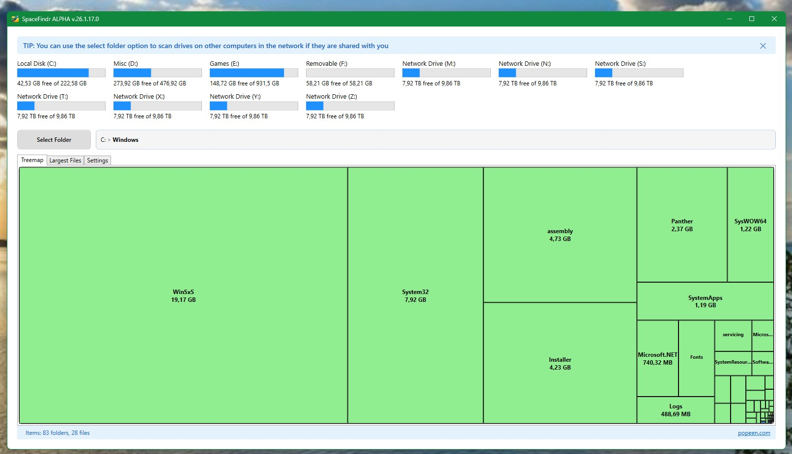

[![downloads-shield]][cvm-link]
[![issues-shield]](issues)
[![license-shield]](LICENSE.md)
[![Buy me a coffee][buymeacoffee-shield]][buymeacoffee-link]

# SpaceFindr

A fresh take on the age old utility for finding what is taking up space on your drives.



## Features

- **Treemap Visualization:** Instantly see which folders and files are taking up the most space.
- **Drive Overview:** View all local, removable, and network drives with usage bars and free space indicators.
- **Largest Files List:** Quickly find and manage the largest files on your system.
- **Easy Navigation:** Easily navigate through folders by clicking boxes or the familiar navigation bar.
- **Ask AI:** Rightclick any file or folder and you can ask AI if it's safe to delete it. * remember, AI can be wrong. 
- **Custom Folder Scanning:** Use the "Select Folder" option to scan any folder, including network shares.
- **Clean UI:** Light, simple, and responsive interface with tooltips and shortcuts.

## Getting Started

1. **Download** the latest release from the [Releases page](https://github.com/popeen/SpaceFindr/releases).
2. **Run** `SpaceFindr.exe` (no installation required).
3. **Select a drive or folder** to begin scanning and visualizing your storage.

## Building from Source

1. Clone this repository:
   ```sh
   git clone https://github.com/popeen/SpaceFindr.git
   ```
2. Open `SpaceFindr.sln` in Visual Studio 2022 or later.
3. Build and run the solution (requires .NET 10).

## License

This project is licensed under the MIT License. See [LICENSE](LICENSE) for details.

## Credits

Created by [popeen](https://popeen.com).

---

*SpaceFindr is open source and welcomes contributions and feedback!*

[downloads-shield]: https://img.shields.io/github/downloads/popeen/SpaceFindr/total
[cvm-link]: https://github.com/popeen/SpaceFindr/releases

[issues-shield]: https://img.shields.io/github/issues-raw/popeen/SpaceFindr.svg

[license-shield]: https://img.shields.io/github/license/popeen/SpaceFindr.svg

[buymeacoffee-shield]: https://img.shields.io/badge/donation-Buy%20me%20a%20coffee-orange
[buymeacoffee-link]: https://www.buymeacoffee.com/popeen
